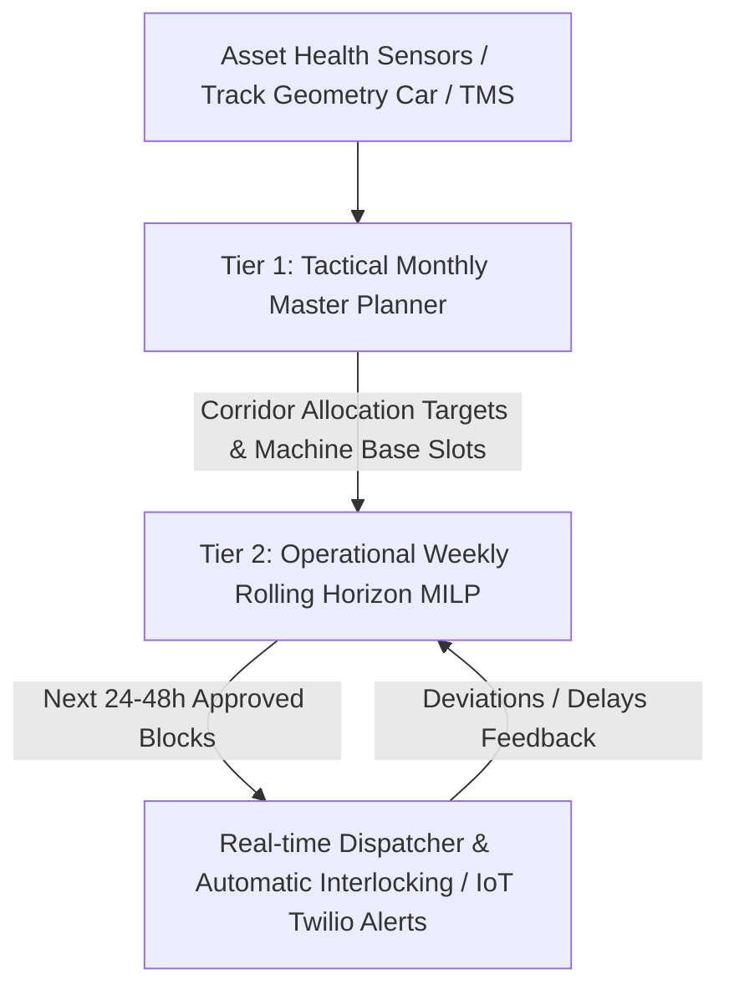
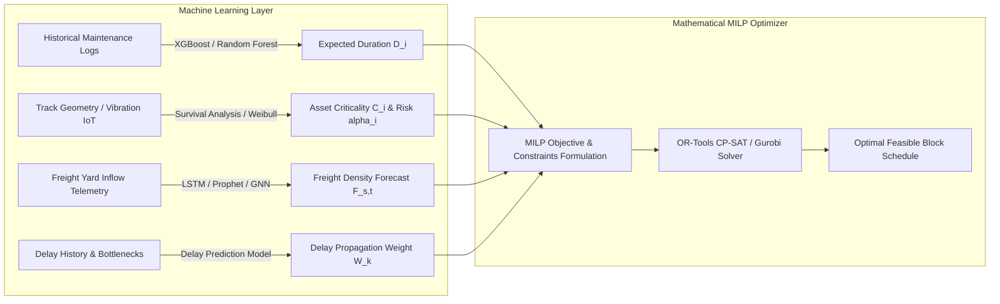

# Mixed-Integer Linear Programming (MILP) for Autonomous Railway Maintenance Block Scheduling

## Executive Summary: Answering the Core Question

> **Core Question:** *“Given multiple maintenance tasks and available railway time windows, how can Mixed-Integer Linear Programming (MILP) mathematically select the best feasible block schedule?”*

In railway operations, maintenance scheduling is an **NP-hard multi-commodity, multi-resource combinatorial optimization problem** with temporal and spatial coupling. 

When solved naively via greedy heuristics (as commonly done in legacy dispatching), the system misses **cross-department synergies** (e.g., co-locating Civil Track Tamping and Electrical OHE inspection on the same segment) and cannot globally balance **train delay penalties against overdue derailment/failure risks**.

### The Mathematical Engine
MILP transforms this problem into a system of **linear constraints over discrete binary variables** (decision flags for assigning tasks to specific track segments and time intervals) and **continuous variables** (exact start/finish timestamps, accumulated train delays, and slack durations). 

The solver explores the convex hull of relaxed linear programming (LP) bounds and systematically prunes suboptimal branches using **Branch-and-Cut**, guaranteeing either:
1. **Mathematical global optimality** (within a provable optimality gap $\epsilon$), or
2. **A mathematically verified certificate of infeasibility** (alerting dispatchers that current safety constraints cannot accommodate all pending tasks without canceling specific train paths).

---

## 1. System Mathematical Notation & Sets

| Symbol | Definition |
| :--- | :--- |
| $\mathcal{T}$ | Set of pending maintenance tasks, indexed by $i \in \{1, \dots, N\}$. |
| $\mathcal{S}$ | Set of track sections / physical corridor blocks, indexed by $s$. |
| $\mathcal{W}$ | Set of candidate block windows / corridor availability intervals, indexed by $w$. |
| $\mathcal{H}$ | Planning time horizon discretized into time slots $t \in \{1, \dots, T\}$ of size $\Delta \tau$ (e.g., 5 or 15 mins). |
| $\mathcal{K}$ | Set of scheduled trains, indexed by $k$ (subdivided into $\mathcal{K}_{\text{vande}}$, $\mathcal{K}_{\text{exp}}$, $\mathcal{K}_{\text{sub}}$, $\mathcal{K}_{\text{goods}}$). |
| $\mathcal{D}$ | Set of railway departments: $\mathcal{D} = \{\text{ENG (Civil)}, \text{TRD (Traction/OHE)}, \text{S\&T (Signal \& Telecom)}\}$. |
| $\mathcal{M}$ | Set of specialized maintenance machines (BCM, CSM/DUO Tamping, Tower Wagon, PQRS). |
| $\mathcal{G}$ | Set of certified maintenance crews / gangs (P-Way gang, OHE depot crew, S\&T eshkort). |

### Parameters

* **$C_i \in [1, 100]$**: Intrinsic criticality / asset safety risk index of task $i$.
* **$\Omega_i \ge 0$**: Overdue duration (in days or running Gross Million Tonnes — GMT) past scheduled maintenance interval.
* **$\alpha_i$**: Exponential overdue penalty escalation factor for task $i$.
* **$\Delta t_i^{\text{prev}}$**: Elapsed operational time since the last maintenance block on this asset.
* **$D_i$**: Required physical execution duration of task $i$ (including machine setup and clearance).
* **$[W_w^{\text{start}}, W_w^{\text{end}}]$**: Feasible temporal boundaries of window $w$.
* **$\text{Sec}(i)$ / $\text{Sec}(w)$**: Track section $s \in \mathcal{S}$ associated with task $i$ or window $w$.
* **$\text{Dep}(i)$**: Department responsible for task $i$ ($\text{Dep}(i) \in \mathcal{D}$).
* **$W_k$**: Delay / cancellation penalty weight of train $k$ ($W_{\text{express}} \gg W_{\text{goods}}$).
* **$\Phi_{k,s,t} \in \{0, 1\}$**: Timetable conflict parameter: $1$ if train $k$ is timetabled to occupy section $s$ at time $t$, $0$ otherwise.
* **$F_{s,t} \in \mathbb{R}_{\ge 0}$**: Predicted freight / goods train flow rate (trains/hour) on section $s$ during slot $t$.
* **$R_{i,m} \in \{0, 1\}$**: Machine requirement flag ($1$ if task $i$ requires machine $m$).
* **$G_{i,g} \in \{0, 1\}$**: Gang requirement flag ($1$ if task $i$ requires crew gang $g$).
* **$E_{s, s'} \in \{0, 1\}$**: Electrical sectioning conflict matrix ($1$ if de-energizing OHE on section $s$ forces isolation of section $s'$ due to feeding post / neutral section architecture).
* **$I_{s, s'} \in \{0, 1\}$**: S&T Interlocking / route-locking conflict matrix ($1$ if isolating section $s$ locks turnouts/points on section $s'$).

---

## 2. Decision Variables

### Discrete Time / Window-Based Representation

1. **Task-to-Window Assignment ($x_{i,w}$):**
   $$x_{i,w} \in \{0, 1\} \quad \forall i \in \mathcal{T}, w \in \mathcal{W}$$
   * $x_{i,w} = 1$ if maintenance task $i$ is executed in window $w$; $0$ otherwise.

2. **Window Activation Flag ($y_w$):**
   $$y_w \in \{0, 1\} \quad \forall w \in \mathcal{W}$$
   * $y_w = 1$ if corridor window $w$ is granted/blocked for maintenance; $0$ if left for normal train traffic.

3. **Continuous Timing Variables:**
   * $S_i \ge 0$: Exact start time of task $i$.
   * $C_i \ge 0$: Exact completion time of task $i$ ($C_i = S_i + D_i$).
   * $\sigma_w \ge 0$: Unused block duration (slack) in window $w$.

4. **Multi-Department Coordination Flag ($z_w$):**
   $$z_w \in \{0, 1\} \quad \forall w \in \mathcal{W}$$
   * $z_w = 1$ if window $w$ is utilized as an **Integrated Mega Block** (co-scheduled by two or more distinct departments $\text{Dep} \in \mathcal{D}$).

5. **Train Perturbation Variables:**
   * $\delta_k \ge 0$: Calculated schedule delay (in minutes) inflicted on train $k$.
   * $\gamma_k \in \{0, 1\}$: Binary flag indicating complete cancellation/rerouting of train $k$.

---

## 3. The Objective Function

The objective is formulated as a **multi-criteria weighted trade-off function** that balances asset reliability and safety against transportation throughput.

$$\max \mathcal{Z} = \mathcal{Z}_{\text{criticality}} + \mathcal{Z}_{\text{urgency}} + \mathcal{Z}_{\text{coordination}} - \mathcal{Z}_{\text{train\_delay}} - \mathcal{Z}_{\text{freight\_impact}} - \mathcal{Z}_{\text{unused\_slack}} - \mathcal{Z}_{\text{downtime}}$$

$$\begin{aligned}
\max \mathcal{Z} = & \underbrace{\sum_{i \in \mathcal{T}} \sum_{w \in \mathcal{W}} C_i \cdot x_{i,w}}_{\text{1. Criticality Value}} 
+ \underbrace{\sum_{i \in \mathcal{T}} \sum_{w \in \mathcal{W}} \left( \alpha_i \cdot \Omega_i + \beta_i \cdot \Delta t_i^{\text{prev}} \right) x_{i,w}}_{\text{2. Overdue \& Degradation Urgency}} 
+ \underbrace{\sum_{w \in \mathcal{W}} \lambda_{\text{coord}} \cdot z_w}_{\text{3. Multi-Dept Synergy Bonus}} \\
& - \underbrace{\sum_{k \in \mathcal{K}} \left( W_k^{\text{delay}} \cdot \delta_k + W_k^{\text{cancel}} \cdot \gamma_k \right)}_{\text{4. Passenger Timetable Disruption}} 
- \underbrace{\sum_{w \in \mathcal{W}} \sum_{t \in \mathcal{H}} \lambda_{\text{freight}} \cdot F_{\text{Sec}(w), t} \cdot y_w}_{\text{5. Freight Delay Cost}} \\
& - \underbrace{\sum_{w \in \mathcal{W}} \mu_{\text{slack}} \cdot \sigma_w}_{\text{6. Unused Corridor Wastage}} 
- \underbrace{\sum_{w \in \mathcal{W}} \theta_{\text{down}} \cdot (W_w^{\text{end}} - W_w^{\text{start}}) \cdot y_w}_{\text{7. Total Line Possession Penalty}}
\end{aligned}$$

### Weight Tuning & Normalization
To prevent numerical instability and dominated objectives, each term is normalized by its theoretical maximum upper bound:

$$\mathcal{Z} = \omega_1 \left( \frac{\mathcal{Z}_{\text{crit}} + \mathcal{Z}_{\text{urg}}}{\text{Max Possible Priority}} \right) + \omega_2 \left( \frac{\mathcal{Z}_{\text{coord}}}{\text{Max Coordinated Windows}} \right) - \omega_3 \left( \frac{\mathcal{Z}_{\text{passenger}}}{\text{Budgeted Delay Threshold}} \right) - \omega_4 \left( \frac{\mathcal{Z}_{\text{freight}}}{\text{Max Freight Loss}} \right) - \omega_5 \left( \frac{\mathcal{Z}_{\text{slack}}}{\text{Max Window Duration}} \right)$$

* Typical Railway Priority Weights: $\omega_1 = 0.35$, $\omega_3 = 0.30$, $\omega_2 = 0.15$, $\omega_4 = 0.15$, $\omega_5 = 0.05$.

---

## 4. Hard Constraints and Safety Regulations

Any feasible schedule output by the MILP must strictly adhere to the following mathematical constraints.

### 4.1. Task Assignment & Single Execution
Each task $i$ can be scheduled **at most once** across all candidate windows in the planning horizon:
$$\sum_{w \in \mathcal{W}} x_{i,w} \le 1 \quad \forall i \in \mathcal{T}$$

For non-deferrable emergency maintenance ($C_i \ge 90$ or $\Omega_i > \text{Threshold}$):
$$\sum_{w \in \mathcal{W}} x_{i,w} = 1$$

### 4.2. Spatial-Corridor Compatibility
A task can only be assigned to a window that physically encompasses its track section:
$$x_{i,w} = 0 \quad \forall (i, w) \text{ such that } \text{Sec}(i) \neq \text{Sec}(w)$$

### 4.3. Temporal Duration and Non-Preemption
If task $i$ is assigned to window $w$, its total duration $D_i$ must fit within the window's boundaries $[W_w^{\text{start}}, W_w^{\text{end}}]$:
$$W_w^{\text{start}} \cdot x_{i,w} \le S_i \quad \forall i \in \mathcal{T}, w \in \mathcal{W}$$
$$C_i = S_i + D_i \quad \forall i \in \mathcal{T}$$
$$C_i \le W_w^{\text{end}} + M(1 - x_{i,w}) \quad \forall i \in \mathcal{T}, w \in \mathcal{W}$$
*(where $M$ is a sufficiently large positive number — Big-M parameter).*

### 4.4. Window Activation and Unused Slack Definition
Window $w$ is active if at least one task is scheduled within it:
$$x_{i,w} \le y_w \quad \forall i \in \mathcal{T}, w \in \mathcal{W}$$
$$y_w \le \sum_{i \in \mathcal{T}} x_{i,w} \quad \forall w \in \mathcal{W}$$

The unused block slack $\sigma_w$ is bounded by:
$$\sigma_w \ge (W_w^{\text{end}} - W_w^{\text{start}}) \cdot y_w - \max_{i \in \mathcal{T}} \{ D_i \cdot x_{i,w} \}$$

### 4.5. Headway, Clearances, and Train Conflict Constraints
A maintenance block cannot overlap with an active train path. Let train $k$ occupy section $s$ during $[T_{k,s}^{\text{arr}}, T_{k,s}^{\text{dep}}]$. If window $w$ covers section $s$, then:
$$S_i \ge T_{k,s}^{\text{dep}} + H_{\text{safety}} - M(1 - x_{i,w}) \quad \forall k \in \mathcal{K}, i \in \mathcal{T}$$
$$\text{OR}$$
$$C_i + H_{\text{safety}} \le T_{k,s}^{\text{arr}} + M(1 - x_{i,w}) + M \cdot \gamma_k \quad \forall k \in \mathcal{K}, i \in \mathcal{T}$$
*(where $H_{\text{safety}}$ is the mandatory block entry/exit headway margin, typically 10–15 minutes for Indian Railways block instruments).*

### 4.6. Traction / OHE Power Isolation Footprint (Electrical Coupling)
When an electrical block is scheduled on track section $s$, all electrically bridged sections $s'$ (defined by $E_{s,s'} = 1$) must either:
1. Also be blocked for traffic (no electric locomotives can run), or
2. Be assigned simultaneous OHE maintenance:
$$y_w \ge y_{w'} \cdot E_{\text{Sec}(w'), \text{Sec}(w)} \quad \forall w, w' \in \mathcal{W} \text{ overlapping in time}$$

### 4.7. S&T Interlocking and Turnout Protection
If a block on section $s$ requires locking cross-over points on section $s'$ ($I_{s, s'} = 1$), train paths through $s'$ are forbidden:
$$\Phi_{k, s', t} \cdot y_w \le 0 \quad \forall t \in [W_w^{\text{start}}, W_w^{\text{end}}], I_{\text{Sec}(w), s'} = 1, \forall k \in \mathcal{K}$$

### 4.8. Machinery and Work Gang Capacity Limits
Each heavy track machine $m$ (e.g., CSM Tamping Machine) and specialized gang $g$ can only be present at **one section at any given moment**:
$$\sum_{i \in \mathcal{T}} R_{i,m} \cdot x_{i,w} \le 1 \quad \forall m \in \mathcal{M}, \forall w \in \mathcal{W}$$
$$\sum_{i \in \mathcal{T}} G_{i,g} \cdot x_{i,w} \le 1 \quad \forall g \in \mathcal{G}, \forall w \in \mathcal{W}$$

**Machine Repositioning / Travel Time Constraint:**
If machine $m$ serves task $i$ in window $w_1$ and task $j$ in window $w_2$:
$$S_j \ge C_i + \text{TransitTime}(\text{Sec}(i), \text{Sec}(j)) - M(2 - x_{i,w_1} - x_{j,w_2}) \quad \forall i, j \in \mathcal{T}, i \neq j$$

---

## 5. Multi-Department Block Coordination ("Shadow" & "Integrated Mega Blocks")

### The Operational Problem
Historically, Engineering (Civil), TRD (Electrical OHE), and S&T apply for separate blocks:
* Monday 02:00–04:00 (Engg: 2 hrs loss)
* Wednesday 01:00–03:00 (TRD: 2 hrs loss)
* Thursday 02:00–04:00 (S&T: 2 hrs loss)
* **Total Disruption: 6 hours over 3 separate nights.**

### The MILP Coordination Formulation
By enabling cross-department co-location, Civil tamping, OHE wire inspection, and point machine testing occur simultaneously in a single **3-hour window**, cutting total corridor closure by 50%.

```
Track Section S: [====================================================]
Civil Engg Gang:   [-------- Tamping Machine (CSM) --------]
OHE Wire Gang:     [-------- Tower Wagon Inspection -------]  (SIMULTANEOUS)
S&T Signal Techs:  [-- Point & Interlocking Testing --]
-----------------------------------------------------------------------
Total Block Time:  | <---------- Single 3-Hour Slot ---------> |
Corridor Savings:  3 hours recovered for Freight & Passenger Traffic!
```

#### Co-location Activation Constraints:
Define department participation indicator $u_{d, w} \in \{0, 1\}$:
$$u_{d, w} \ge x_{i, w} \quad \forall i \in \mathcal{T} \text{ where } \text{Dep}(i) = d$$
$$u_{d, w} \le \sum_{i \in \mathcal{T}: \text{Dep}(i) = d} x_{i, w}$$

A window $w$ is an **Integrated Mega Block** ($z_w = 1$) if at least 2 distinct departments participate:
$$\sum_{d \in \mathcal{D}} u_{d, w} \ge 2 \cdot z_w$$
$$z_w \ge \frac{1}{|\mathcal{D}| - 1} \left( \sum_{d \in \mathcal{D}} u_{d, w} - 1 \right)$$

#### Departmental Safety Separation Constraint:
Civil heavy machinery (e.g., Ballast Cleaner) and OHE Tower Wagons cannot physically occupy the exact same meter of track. If two coordinated tasks $i, j$ share section $s$:
$$\text{TrackDistance}(\text{Asset}(i), \text{Asset}(j)) \ge \Delta_{\text{min\_safe\_buffer}} \quad (\text{e.g., } \ge 500\text{ meters})$$

---

## 6. Weekly vs. Monthly Scheduling Architecture

Scheduling railway blocks spans multiple time scales. Attempting to solve a full 30-day horizon with 5-minute granularity in a single MILP instance causes exponential state explosion ($2^{100,000+}$ branches). 

The optimal architecture is a **Two-Tier Hierarchical Decomposition with a Rolling Horizon**:



### Tier 1: Tactical Monthly Master Planner (Macro MILP)
* **Horizon:** 30–60 days.
* **Granularity:** Coarse shifts (4-hour windows, daytime off-peak vs. night slots).
* **Decisions:** 
  * Heavy machine routing between railway divisions.
  * Major corridor renewal projects (PQRS track replacement).
  * Aligning with seasonal freight timetables.

### Tier 2: Operational Weekly Rolling Horizon (Micro MILP)
* **Horizon:** 7 days rolling, re-optimized every 24 hours (or dynamically on major incident).
* **Granularity:** 5-minute time steps.
* **Execution:**
  1. Solve MILP for days $t \dots t+7$.
  2. **Freeze** decisions for day $t+1$ (lock work orders, crew rosters, and locomotive diversions).
  3. Advance clock by 24 hours: roll horizon to days $t+1 \dots t+8$, update asset conditions from telemetry, and re-solve.

---

## 7. Mathematical Solvers: Comparative Benchmarks & Evaluation

| Solver | Engine Type | Pros | Cons | Best Use Case |
| :--- | :--- | :--- | :--- | :--- |
| **Google OR-Tools (CP-SAT)** | Constraint Programming & SAT-based branch & bound | Exceptional performance on discrete scheduling, non-overlapping intervals (`NewIntervalVar`), and resource limits. Completely open-source (Apache 2.0). | Cannot natively optimize pure continuous linear relaxations as well as LP solvers; Big-M formulations must be converted to boolean logic. | **Primary choice for Weekly & Daily Block Scheduling** where intervals and non-overlaps dominate. |
| **Gurobi Optimizer** | State-of-the-art Primal/Dual Simplex & Branch-and-Cut | The fastest commercial MILP solver in the world. Exceptional barrier solver, presolve reductions, and heuristic cuts. Native Python/C++ API. | Expensive commercial license (free for academic research, costly for enterprise production). | **Enterprise-grade Monthly Tactical Planning & Complex Network-wide Routing**. |
| **IBM CPLEX** | Simplex & Branch-and-Cut | Industry veteran, rock-solid stability, proven in global airline and railway scheduling. | Commercial license; slightly slower algorithmic innovation speed compared to Gurobi in recent years. | Legacy railway enterprise systems (e.g., integrated with IBM Maximo). |
| **HiGHS / SCIP** | Open-source MILP Branch-and-Cut | No licensing fees; built-in to SciPy (`scipy.optimize.milp`). | 5x to 20x slower than Gurobi on large mixed-integer instances. | Prototyping and local development testing. |

### Solver Recommendation for BlockTrain:
* **Production Recommended Stack:** **Google OR-Tools CP-SAT**. 
* **Why CP-SAT?** Railway block scheduling is fundamentally an **Interval Scheduling Problem**. In OR-Tools CP-SAT, intervals are first-class citizens (`model.NewIntervalVar(start, size, end, 'block')`), and spatial exclusivity is handled via the hyper-optimized `AddNoOverlap()` propagator, which eliminates the need for numerically fragile Big-M linearizations!

---

## 8. Bridging Machine Learning to the MILP Engine

The mathematical MILP model should not be replaced by ML; rather, **Machine Learning acts as the parameter generator (Feature $\rightarrow$ Parameter Mapper)** for the MILP optimizer.



### Specific ML-to-MILP Parameter Pipelines

1. **Task Duration Estimation ($\hat{D}_i$):**
   * *Problem:* A tamping task scheduled for 120 minutes often takes 160 minutes due to soil density, track curvature, or crew fatigue, blowing up the block window.
   * *ML Model:* **XGBoost Regressor / LightGBM**.
   * *Input Features:* Ballast deficiency index, asset age, track gradient/curvature, machine ID, gang experience index, ambient weather/temperature.
   * *MILP Ingestion:* $D_i = \hat{D}_i + k \cdot \sigma_{\hat{D}_i}$ (where $k \cdot \sigma$ provides a risk-calibrated buffer).

2. **Asset Degradation & Criticality Scoring ($C_i, \Omega_i$):**
   * *Problem:* Priority shouldn't be a static guess; it should reflect probability of catastrophic rail fracture or OHE snapping.
   * *ML Model:* **Survival Analysis (Cox Proportional Hazards or Random Survival Forests)** or Deep Recurrent Neural Networks on Track Recording Car (TRC) acceleration data.
   * *MILP Ingestion:* Criticality parameter $C_i = 100 \times P(\text{Failure in next } 7\text{ days} \mid \text{Telemetry})$.

3. **Freight Flow Forecasting ($F_{s,t}$):**
   * *Problem:* Goods trains run without a fixed timetable in Indian Railways; scheduling a block in an unpredicted freight surge creates nationwide supply chain logjams.
   * *ML Model:* **Temporal Graph Convolutional Network (T-GCN)** on yard loading and rake interchange points.
   * *MILP Ingestion:* Sets the penalty coefficient $F_{s,t}$ in the objective function.

4. **"Smart Predict-Then-Optimize" (SPO / Decision-Focused Learning):**
   * Instead of training ML to minimize Mean Squared Error (MSE) on durations, train the neural network weights directly against the **MILP subgradient loss**, minimizing actual train delays caused by schedule mispredictions.

---

## 9. Concrete Formulation Walkthrough: A Minimal Working Model

To illustrate how the MILP makes optimal decisions, consider this concrete toy scenario on the **Tambaram – Chromepet corridor**:

### Input Scenario
* **Corridor:** Double Line Section (Up Main Line, Down Main Line).
* **Available Windows:**
  * Window $W_1$: Down Line, 01:00 – 04:00 (Night, 180 min duration). Freight traffic low ($F = 0.5$ trains/hr).
  * Window $W_2$: Down Line, 11:30 – 13:30 (Day off-peak, 120 min duration). High suburban train density.
* **Pending Tasks:**
  * Task 1 (Civil Engg): Rail Joint Weld Testing on Down Line. $D_1 = 90$ min. Criticality $C_1 = 80$.
  * Task 2 (TRD OHE): Contact Wire Stagger Inspection on Down Line. $D_2 = 100$ min. Criticality $C_2 = 60$.
  * Task 3 (S&T): Axle Counter Reset & Point Testing. $D_3 = 45$ min. Criticality $C_3 = 40$.
* **Trains:**
  * Train 1 (Vande Bharat Express): Traverses Down Line at 12:15. Cancellation Penalty $W_1 = 10,000$.
  * Train 2 (Goods Container Rake): Scheduled at 02:30. Delay Penalty $W_2 = 300$.

### Decision Making: Greedy Heuristic vs. MILP

#### What a Greedy System Does:
* Sees Task 1 ($C_1 = 80$) fits in $W_2$ (120 min). Assigns Task 1 to $W_2$.
* But $W_2$ overlaps with Vande Bharat at 12:15! A severe train delay/penalty is incurred, or the block is rejected at the last minute by the human controller.
* Task 2 and Task 3 are assigned to separate nights, consuming two future block requests.

#### What the MILP Model Does:
1. Calculates that $W_2$ carries a severe train penalty ($W_{\text{vande}} = 10,000$). Sets $y_{W_2} = 0$ (leaves Day Window open for passenger traffic).
2. Inspects $W_1$ (180 minutes available).
3. Evaluates co-location of Task 1 ($90\text{ min}$), Task 2 ($100\text{ min}$), and Task 3 ($45\text{ min}$):
   $$\max(D_1, D_2, D_3) = 100\text{ min} \le 180\text{ min} \implies \text{Feasible within } W_1!$$
4. Evaluates Multi-Department Coordination bonus:
   $$\text{Departments} = \{\text{ENG, TRD, S\&T}\} \implies |\mathcal{D}| = 3 \implies \text{Max Synergy Bonus!}$$
5. Absorbs the minor goods train delay ($W_{\text{goods}} = 300$).
6. **Result:** All 3 critical maintenance tasks are bundled into a single night slot $W_1$. Zero passenger trains delayed, zero emergency cancellations, asset safety maximized.

---

## 10. Python Implementation Blueprint (Google OR-Tools CP-SAT)

The following production-ready Python snippet shows how this formulation maps directly to code:

```python
from ortools.sat.python import cp_model

def solve_railway_block_milp(tasks, windows, trains):
    model = cp_model.CpModel()
    
    # 1. Decision Variables
    # x[i, w]: Task i scheduled in Window w
    x = {}
    for i, t in enumerate(tasks):
        for w, win in enumerate(windows):
            x[i, w] = model.NewBoolVar(f"task_{i}_win_{w}")
            
    # y[w]: Window w activated
    y = {w: model.NewBoolVar(f"win_active_{w}") for w in range(len(windows))}
    
    # z[w]: Coordinated Mega-Block indicator
    z = {w: model.NewBoolVar(f"mega_block_{w}") for w in range(len(windows))}
    
    # 2. Hard Constraints
    # Task assigned at most once
    for i, t in enumerate(tasks):
        model.Add(sum(x[i, w] for w in range(len(windows))) <= 1)
        # If highly critical/urgent, force execution
        if t.get("criticality", 0) > 85:
            model.Add(sum(x[i, w] for w in range(len(windows))) == 1)

    # Window capacity and track section matching
    for w, win in enumerate(windows):
        for i, t in enumerate(tasks):
            # Section match constraint
            if t["section_id"] != win["section_id"]:
                model.Add(x[i, w] == 0)
            # Duration constraint
            if t["duration_min"] > win["duration_min"]:
                model.Add(x[i, w] == 0)
            # Activation binding
            model.Add(x[i, w] <= y[w])

    # Departmental Co-ordination Logic
    for w, win in enumerate(windows):
        dept_flags = []
        for dept in ["ENG", "TRD", "S&T"]:
            d_flag = model.NewBoolVar(f"dept_{dept}_win_{w}")
            tasks_in_dept = [x[i, w] for i, t in enumerate(tasks) if t["dept"] == dept]
            if tasks_in_dept:
                model.AddMaxEquality(d_flag, tasks_in_dept)
            else:
                model.Add(d_flag == 0)
            dept_flags.append(d_flag)
            
        # Coordinated if >= 2 departments are active
        model.Add(sum(dept_flags) >= 2).OnlyEnforceIf(z[w])
        model.Add(sum(dept_flags) < 2).OnlyEnforceIf(z[w].Not())

    # 3. Objective Function
    objective_terms = []
    
    # + Criticality and Overdue Priority
    for i, t in enumerate(tasks):
        prio_weight = int(t.get("criticality", 50) + 1.5 * t.get("overdue_days", 0))
        for w in range(len(windows)):
            objective_terms.append(prio_weight * x[i, w])
            
    # + Multi-Department Coordination Bonus
    for w in range(len(windows)):
        objective_terms.append(150 * z[w])
        
    # - Train Disruption Penalty
    for w, win in enumerate(windows):
        disruption_penalty = win.get("train_disruption_cost", 50)
        objective_terms.append(-disruption_penalty * y[w])

    model.Maximize(sum(objective_terms))

    # 4. Solve
    solver = cp_model.CpSolver()
    solver.parameters.max_time_in_seconds = 30.0
    solver.parameters.num_search_workers = 8
    
    status = solver.Solve(model)
    return solver, status, x, y, z
```

---

## 11. Recommended Next Steps for the Team

1. **Mathematical Validation:** Adopt the decision variables, objective terms, and constraints formulated above as the formal specification for the BlockTrain core engine.
2. **Train the ML Predictive Models First:** Before coupling to the solver, develop the baseline ML models to predict:
   * **Task True Duration ($\hat{D}_i$)** using historical maintenance job cards.
   * **Corridor Freight Density ($F_{s,t}$)** across operational corridors.
3. **Solver Integration:** Plug the outputs of these ML models directly into the **Google OR-Tools CP-SAT** model (as structured in Section 10) to generate globally optimal, conflict-free block schedules.
